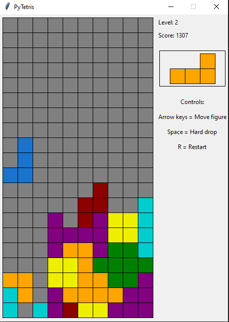
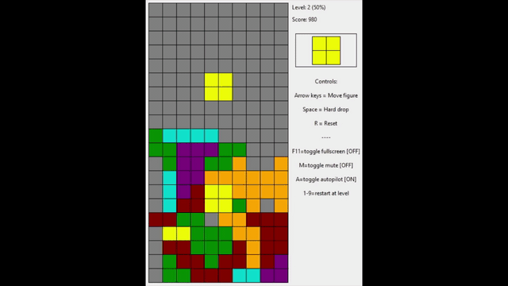

Run with:
> python main.py

- requires Python 3.8

_with each new level (everytime you break 10 lines) the background soundtrack gets faster to keep you in the beat!_

* pressing 'A' will toggle autopilot mode (AI will take control)

Preview:

Idea flow:
1. Implement tetris rules ✔️
2. Make it playable as human ✔️
3. Make a heuristic AI playing it ✔️
    * demo:
    
     
# IF I HAVE TIME IN THE FUTURE:
4. Try to create machine learning AI to play it.
    * learning heuristic parameters for best fitness function.