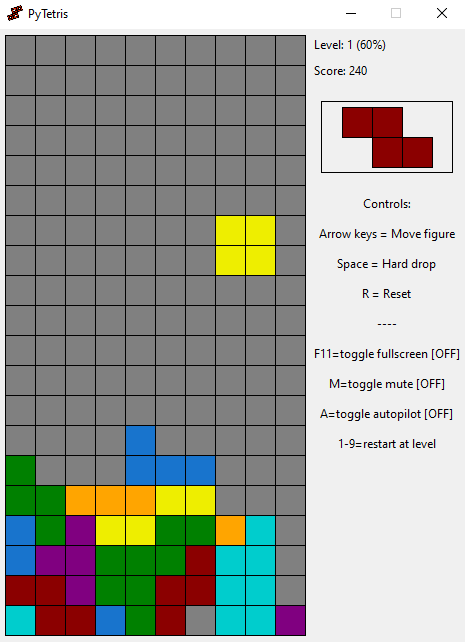

Run with:
> python main.py

- requires Python 3.8

_with each new level (everytime you break 10 lines) the background soundtrack gets faster to keep you in the beat!_

Preview:

Idea flow:
1. Implement tetris rules ✔️
2. Make it playable as human ✔️

# WORK IN PROGRESS

3. Make a heuristic AI playing it
4. Try to create machine learning AI to play it.